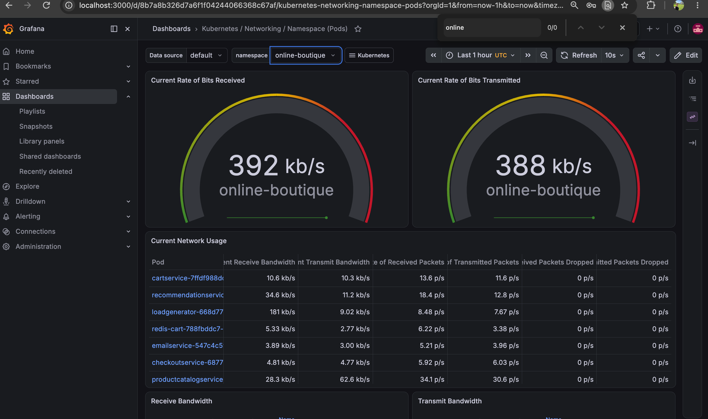

# Online Boutique Kubernetes Deployment

This project documents my deployment, validation, and troubleshooting of Google Cloud’s **Online Boutique** microservices application on a local Kubernetes cluster using Docker Desktop.

The goal was to gain hands-on experience with Kubernetes workloads, service discovery, networking, self-healing, ephemeral storage, and troubleshooting.

## Project Overview

Online Boutique is a cloud-native e-commerce application composed of multiple microservices that communicate primarily through gRPC.

The deployed workloads include:

- Frontend
- Cart service
- Checkout service
- Product catalog service
- Currency service
- Payment service
- Shipping service
- Email service
- Recommendation service
- Advertisement service
- Load generator
- Redis

## Technologies Used

- Kubernetes
- Docker Desktop
- kubectl
- Git and GitHub
- Redis
- YAML
- gRPC microservices
- Kubernetes Services
- EndpointSlices

## Local Environment

- macOS on Intel
- Docker Desktop Kubernetes
- Kubernetes v1.36.1
- kubectl v1.36.2
- Dedicated namespace: `online-boutique`

## Architecture

Most microservices are exposed internally through Kubernetes `ClusterIP` Services.

The frontend communicates with backend services using Kubernetes DNS names:

```text
frontend
├── productcatalogservice:3550
├── currencyservice:7000
├── cartservice:7070
├── recommendationservice:8080
├── shippingservice:50051
├── checkoutservice:5050
└── adservice:9555

## Deployment

Clone the repository:

```bash
git clone https://github.com/artemsaitov/online-boutique-kubernetes-deployment.git
cd online-boutique-kubernetes-deployment
git switch portfolio-deployment

## Monitoring with Prometheus and Grafana

I installed the `kube-prometheus-stack` Helm chart to add monitoring for the local Kubernetes cluster.

The stack includes:

- Prometheus
- Grafana
- Alertmanager
- Prometheus Operator
- kube-state-metrics
- node exporter

The standard Helm repository repeatedly timed out while downloading the repository index, even though the URL was reachable with `curl`.

To work around this issue, I installed the chart directly from the Prometheus Community OCI registry:

```bash
helm install monitoring \
  oci://ghcr.io/prometheus-community/charts/kube-prometheus-stack \
  --namespace monitoring \
  --create-namespace \
  --values portfolio-k8s/monitoring-values.yaml \
  --timeout 15m
```

Verify the monitoring workloads:

```bash
kubectl get pods -n monitoring
```

Access Grafana locally:

```bash
kubectl port-forward \
  -n monitoring \
  service/monitoring-grafana \
  3000:80
```

Grafana is then available at:

```text
http://localhost:3000
```

The Grafana dashboards were used to monitor the `online-boutique` namespace, including:

- Pod network receive and transmit rates
- Packet activity
- Pod resource usage
- Workload health
- Kubernetes cluster metrics

The Online Boutique load generator continuously creates traffic, making it possible to observe live application activity in Grafana.


## Kustomize Deployment

To make the Kubernetes configuration reusable, I created a Kustomize base and a local overlay:

```text
portfolio-k8s/
├── base/
│   ├── kubernetes-manifests.yaml
│   └── kustomization.yaml
└── overlays/
    └── local/
        └── kustomization.yaml
```

The local overlay:

- Deploys resources into the `online-boutique` namespace
- Adds portfolio and environment labels
- Reuses the common base manifest
- Avoids editing Google’s generated release manifest directly

Preview the rendered configuration:

```bash
kubectl kustomize portfolio-k8s/overlays/local
```

Validate it against the Kubernetes API without changing resources:

```bash
kubectl apply \
  -k portfolio-k8s/overlays/local \
  --dry-run=server
```

Deploy the overlay:

```bash
kubectl apply -k portfolio-k8s/overlays/local
```

The initial overlay referenced a manifest outside the Kustomize directory tree, which Kustomize blocked for security. I resolved this by introducing a standard base-and-overlay directory structure.

## Horizontal Scaling Test

The `cartservice` Deployment was scaled from one replica to three:

```bash
kubectl scale deployment cartservice \
  -n online-boutique \
  --replicas=3

Kubernetes created three healthy Pods, and the cartservice EndpointSlice automatically updated to include all three Pod IP addresses.

All cart Pods were then deleted during a self-healing test. The Deployment recreated the desired three replicas automatically.

After validation, the Deployment was scaled back to one replica:
kubectl scale deployment cartservice \
  -n online-boutique \
  --replicas=1
  This demonstrated horizontal scaling, Service endpoint updates, and Deployment self-healing.